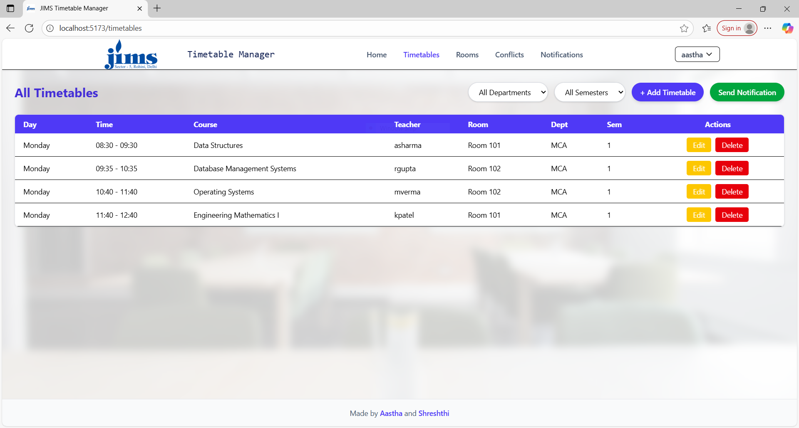
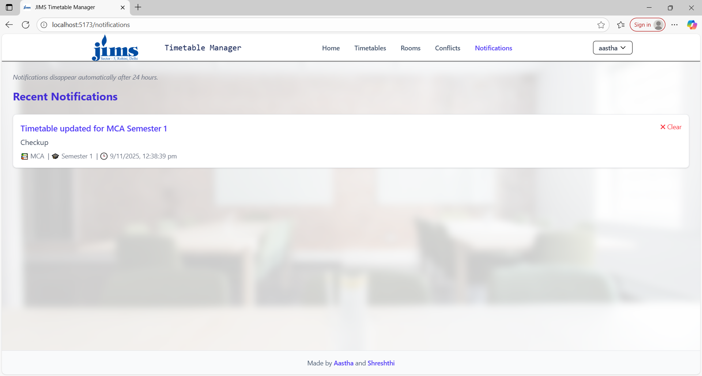
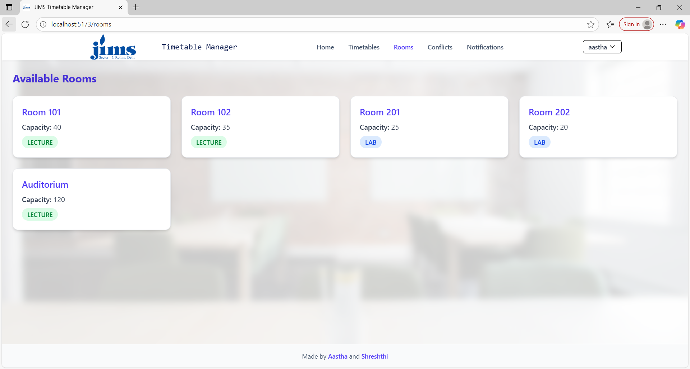

#  Timetable Management System

A web-based system built using the **MERN Stack (MongoDB, Express, React, Node.js)** for managing academic timetables efficiently. The app enables administrators to create, edit, and delete class schedules, detect conflicts, and send timetable update notifications via email.

---

##  Features

- **Admin Controls:** Add, edit, and delete timetable entries.
- **Email Notifications:** Sends update alerts using Brevo API.
- **Conflict Detection:** Highlights overlapping schedules (teacher, room, or time).
- **Responsive UI:** Clean design built with Tailwind CSS.

---

##  Tech Stack

**Frontend:** React.js, Tailwind CSS, Axios  
**Backend:** Node.js, Express.js, MongoDB Cloud(Mongoose)  
**Email Service:** Brevo 

---

##  Setup Instructions

### 1. Clone the Repository
```bash
git clone https://github.com/Aastha-2304/timetable_management.git
cd timetable_management
```

### 2. Install Dependencies
**Backend:**
```bash
cd server
npm install
```


### 3. Configure Environment Variables
Create a `.env` file inside `/server` and add:
```env
PORT=5000
MONGO_URI=your_mongodb_connection_string
JWT_SECRET=your_secret_key
BREVO_API_KEY=your_brevo_api_key
```

### 4. Run the Project
**Backend:**
```bash
npm run dev
```
**Frontend:**
```bash
npm run dev
```

Open [http://localhost:5173](http://localhost:5173)

---

##  Email Notifications
Notifications are sent using **Brevo API** with subjects like:
> "Timetable updated for MCA Semester 3"

---

##  Pages Overview

| Page | Description |
|------|--------------|
| **Timetables** | CRUD operations, filters, and notifications |
| **Rooms** | Displays room details in card view |
| **Conflicts** | Shows overlapping entries |
| **Notifications** | Displays all recent notifications (auto-expires after 24h) |

---

##  Previews





---

## Potential Future Updates
1. Registration E-mail verification with OTP
2. UI updates for mobile devices
3. Mini dashboard on homepage

---

**Developed by:** Aastha and Shreshthi
GitHub: [Aastha-2304](https://github.com/Aastha-2304)
GitHub: [shreshthisuman25](https://github.com/shreshthisuman25)

